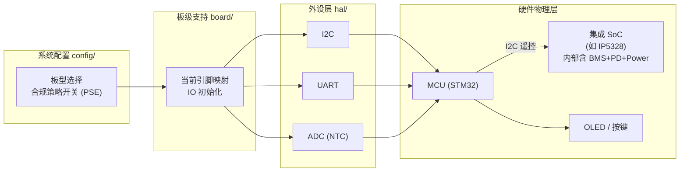

# openBattery 模块化硬件与软件框架 (SoC 双核协同版)

> 最新更新：2026-06-25

## 1. 文档目的
本文档用于统一 `openBattery` 当前阶段对“平台要做什么、当前已经做到哪里、后面应如何分层推进”的理解。

它重点回答三件事：

1. 当前需求到底在收敛什么。
2. 开源平台方案的核心诉求是什么。
3. 当前 `openBmsClaw` 工程应该按照什么架构继续演进。

本文档是：

- 当前主线架构与分层指导文档
- 组内讨论用统一口径
- 后续代码分层和模块接入的边界依据

本文档不是：

- 完整产品规格书
- 量产硬件定板文件

---

## 2. 当前需求理解

## 2.1 当前主目标
`openBattery` 当前主目标，不是先做出一台功能堆满的移动电源整机，而是先形成一套：

- 兼容高集成度 SoC（如英集芯、智融等）
- 具备数字化应用功能与可视化能力
- 可由中小团队二次开发与快速克隆
- 可从最小 bring-up 逐步演进到平台化

的开源电源管理 / BMS 平台起点。

换句话说，当前最重要的不是“先把所有功能写全”，而是“先把脑体协同结构搭对、API 边界讲清、起步工程跑稳”。

## 2.2 当前阶段的真实落点
结合项目的最新战略收敛，当前阶段更准确的落点是：

1. 以 `openBmsClaw` 现有 STM32 起步工程作为当前代码事实。
2. 以 `STM32F103C8T6` 学习板作为当前最小 MCU 验证平台。
3. 先完成 MCU 侧的 `LED / UART / I2C` 等基础 bring-up 与可观测性建设。
4. 先把 `board / hal / drivers(SAL) / services / app / config` 结构固定下来。
5. 为后续通过 I2C/UART 接入集成 SoC 预留标准通信和封装接口。

因此，当前需求不是“本周完成完整移动电源平台”，而是：

> 先把双核协作骨架、SoC 接口抽象、最小调试链路和后续服务编排边界做正确。

## 2.3 当前需求中的边界澄清
为避免讨论跑偏，需要固定以下边界：

- `openBmsClaw/`：当前代码事实与验证入口。
- `90_documents/`：外部文档与立项/参考资料，不作为当前实现。
- `build/`：生成物，不作为架构事实来源。
- `91.reference/`：外部资料归档，不默认作为当前实现内容。

---

## 3. 开源平台的核心诉求

## 3.1 平台不是单一产品固件
`openBattery` 要服务的对象，不是单一 SKU，而是一类可变化的高品质移动电源方案。

所以平台必须优先支持：

- 不同 MCU 基线（当前起步 F103，未来量产候补优先评估 64KB Flash 档位 F030；若 F030 样片验证无法满足资源、外设或可靠性要求，再上移到 STM32G0、GD32E230 或更宽裕 MCU）
- 不同集成 SoC 芯片（英集芯 IP 系列、智融 SW 系列）
- 不同显示与交互形态（LED 跑马灯、OLED 剩余时长预测）
- 不同底座 / 托盘扩展方式
- 日本市场合规逻辑裁剪（PSE，≤100Wh 门槛）

## 3.2 平台必须解决的核心问题
开源平台真正要解决的是下面这些重复成本：

1. 更换底层供电 SoC 时，不要整套业务逻辑和功率分配策略重写。
2. 从单一样机走向多个 SKU 时，不要所有显示和交互逻辑重新复制。
3. 遵循“要接口不要源码”的原则，确保能够对接厂商闭源库，但不被黑盒绑死。
4. 新成员加入时，能快速看清模块职责、接线入口和验证路径。

## 3.3 平台架构应坚持的原则

### 1) 脑体分工
SoC 负责底层硬件协议与 BMS 物理保护（体力活），MCU 负责数据提取、策略仲裁和用户呈现（脑力活）。

### 2) 抽象屏蔽 (SAL)
必须建立统一的 SoC 抽象层 (SoC Abstraction Layer)，屏蔽不同厂商寄存器和闭源 SDK 的差异。

### 3) 可观测
平台起步阶段必须优先保证日志、错误状态、I2C 通信状态可观察，否则后续接 SoC 会持续陷入盲调。

### 4) 小步验证
先做 MCU 最小可运行验证，再打通单条 SoC 通信基线，最后扩展复杂功能。

---

## 4. 总体架构理解

## 4.1 架构核心思想
整体架构应围绕一条主线展开：

> 上层只表达业务策略和可视化交互，中间层提供跨 SoC 的标准 API 抹平差异，下层负责基础外设驱动与板级映射。

这样做的目的，是把两类变化彻底解耦：
- 上层产品功能变化（怎么显示、分配多少功率）
- 下层集成 SoC 选型变化（用哪家芯片）

## 4.2 软件分层图

```mermaid
flowchart TB
    subgraph App["产品应用层 app/"]
        UI["人机交互\nLED/OLED 显示\n剩余时长预测计算"]
        EXT["外部通信\nBLE 状态机\nIAP 固件升级"]
        EVENT["业务事件总线\n常规按键与状态轮询"]
    end

    subgraph Service["智能服务层 services/"]
        ALLOC["功率调度器 srv_power_alloc\n多口接入动态分配"]
        THERMAL["热管理守护 srv_thermal\n动态下调 OCP 阈值"]
        BRINGUP["基础验证 bringup_service"]
    end

    subgraph Driver["SoC 抽象层 (SAL) drivers/"]
        direction TB
        API["标准 API\nsoc_get_voltage()\nsoc_set_ocp()\nsoc_get_temp()"]
        INJOINIC["英集芯 IP53xx 适配器"]
        ISMAR"]["智融 SW35xx 适配器"]
        API --> INJOINIC
        API --> ISMAR
    end

    subgraph Hal["MCU 外设包装层 hal/"]
        I2C["hal_i2c (非阻塞/防挂死)"]
        UART["hal_uart"]
        ADC["hal_adc"]
    end

    App --> Service
    Service --> Driver
    Driver --> Hal
    Driver -. "紧急告警高速通道\n(逆向通行证)" .-> Service
```

## 4.3 板级绑定与硬件映射图



## 4.4 这两张图要表达的重点

1. `app/` 和 `services/` 绝不能直接碰具体 SoC 的寄存器地址。
2. 以前分离的 BMS、电源、协议模块，现在统一由 `SOC` 承接物理执行。
3. `drivers/` 被重新定义为兼容多家 SoC SDK 的“统一接头人”。
4. `hal/` 只做纯净的 MCU I2C/UART 读写透传。

---

## 5. 各层职责说明

## 5.1 `app/`
`app/` 是产品业务与数字化展示层。

它负责：
- 运行剩余时间预测模型与 SOH 算法。
- 组织 OLED/LED 的交互逻辑和按键状态机。
- 处理外部 BLE 连接协议。

它不负责：
- 决定哪个口限流多少（由 services 负责）。
- 发送 I2C 数据包。

## 5.2 `services/`
`services/` 是平台核心调度层。

它负责把“产品策略”翻译成“SoC 指令”：
- `srv_power_alloc`：监听多口插入事件，计算总功率池，向 SoC 下发端口限流指令。
- `srv_thermal`：通过外部 ADC 获取板级 NTC 温度，结合 SoC 内部温度，动态下调系统输出功率阈值。
- **紧急事件就地仲裁**：对于危及电芯安全的硬件中断（物理过温、多口短路等），不再走 `app/` 层的普通事件队列，而是接受 `drivers/` 层的“逆向高速通道”信号量唤醒，实现毫秒级紧急关断。

## 5.3 `drivers/` (SoC SAL)
`drivers/` 是集成 SoC 抽象适配层。

它负责：
- 提供一套标准的 SoC 操控 API。
- 把上层从具体芯片闭源库或繁杂寄存器表中隔离出来。
- 统一上报 SoC 产生的中断（如握手成功、短路）。
- **总线自愈与防死锁机制 (Bus Recovery)**：当检测到 I2C 死锁（如 SDA 持续拉低）时，通过 GPIO 模拟 9 个时钟脉冲强制释放总线，防止大脑死机。
- **固件透传 API (Passthrough IAP)**：预留 `soc_firmware_flash_stream()` 等接口，允许 MCU 将快充协议固件升级包“喂”给内置 Flash 的高端 SoC。

## 5.4 `hal/`
`hal/` 是纯净的 MCU 内部外设访问包装层。

它负责：
- 封装底层的 GPIO/I2C/UART 句柄。
- 让 `drivers/` 层在发送数据时不用关心具体的硬件传输细节。
- **强制推行非阻塞式驱动（DMA + 中断）或硬件 Timeout**：坚决避免 I2C 阻塞死等导致 MCU 核心主循环被 SoC 的“打嗝”拖死。

## 5.5 `board/` 与 `config/`
`board/` 统一描述当前板型引脚映射。
`config/` 承接带来功能差异的宏开关，除了日本市场合规限制外，**必须包含 UI 与算法的严格裁剪宏**（一键关闭字库、复杂协议栈），确保初期的 Phase 1~3 能在 64KB Flash 的 STM32F103 上安全跑通，避免发生“资源陷阱”。

---

## 6. 当前阶段建议的工作顺序

## 6.1 第一阶段：稳定 MCU 起步环境
先把下面几件事做稳：
1. `board_init()`、`app_init()` 主流程固定。
2. MCU 自身的 `LED / UART / I2C` 基础 bring-up 跑通。
3. 日志、错误状态可观察。

## 6.2 第二阶段：构建 SoC 抽象层与基线接入 (关键里程碑)
在 MCU 跑稳后，继续做：
1. 固定 `drivers/` 里的统一 API 定义。
2. 选定一款核心 SoC（如英集芯 IP 系列），打通 MCU 到 SoC 的 I2C 通信。
3. 完成标准数据读取（电压、温度）和参数下发验证。

## 6.3 第三阶段：服务层与策略落地
推荐顺序：
1. 编写热管理和 OCP 动态下发逻辑。
2. 编写多设备功率动态仲裁逻辑。
3. 验证 MCU 对 SoC 的“遥控”是否生效。

## 6.4 第四阶段：数字化应用与交互
1. 接入真实的 OLED/LED。
2. 呈现剩余时间、系统告警。
3. 增加合规检查（≤100Wh 等逻辑限位）。

---

## 7. 常见误区澄清

后续讨论时，需要避免三种常见混淆：

1. **把集成 SoC 的功能当成要 MCU 自己写的逻辑**：不要在 MCU 里用定时器去模拟快充协议，也不要在 MCU 里去拉低管脚做硬开关控制，这是 SoC 该做的事。
2. **要求 SoC 厂开放底层源码**：遵循“要接口不要源码”的集成准则，只向原厂要必要的 API 头文件或寄存器文档。
3. **把起步板当成最终产品**：当前的 F103 只是验证 MCU 与 SoC 协同架构的载体，不是最终量产定型。

---

## 8. 当前结论
当前 `openBattery` 架构已从“MCU 造一切轮子”演变为：

> **通过标准 API 抽象，使 MCU 成为统筹调度多厂商 SoC 的智慧大脑。**

只要按这个框架执行，代码将天然具备高度的防腐性和跨项目可复用性。
