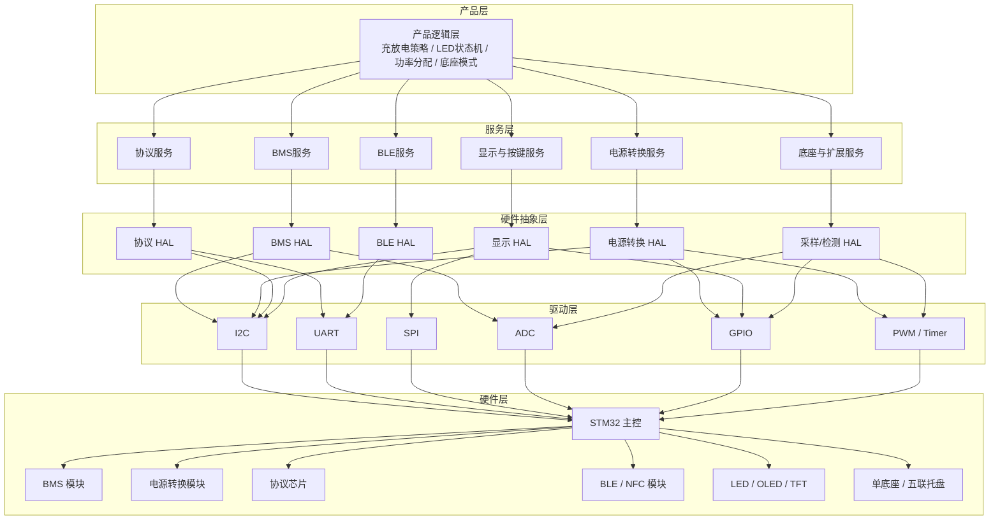

# 模块化硬件与软件框架设计

## 1. 文档目的
本文档用于说明开源移动电源系统的硬件与软件框架设计思路，核心目标只有一个：

> **兼容多种模块，让厂商可以像搭积木一样自由组合，并在可控成本下快速完成产品开发。**

因此，本方案不追求“做一套固定产品”，而是要定义一套 **标准接口、标准分层、标准接入方式**，让不同成本档位、不同供应链条件、不同功能诉求的厂商，都能基于同一框架做出各自的产品。

---

## 2. 核心设计思路

### 2.1 设计原则
为了支撑“自由组合”的目标，系统设计必须同时满足以下原则：

1. **模块化**
   BMS、电源转换、协议芯片、BLE、显示、底座通信等能力应拆分为可替换模块，而不是耦合成单一硬件方案。

2. **标准化**
   每类模块都要定义统一的电气接口、通信接口和软件接口，避免因更换供应商而大面积改板或重写业务逻辑。

3. **分层化**
   产品逻辑、设备服务、驱动适配、底层硬件控制必须分层，确保功能扩展时不会牵动全局。

4. **合规优先**
   设计必须围绕 2026 年新国标《移动电源安全技术规范》展开，安全与保护逻辑不能在后期补丁式添加。

5. **低门槛落地**
   中小厂商应能从参考设计、兼容清单和接入指南中快速起步，而不是从零构建整套架构。

### 2.2 本框架解决的问题
本框架主要解决以下行业痛点：

- 不同厂商使用不同 BMS/协议芯片，软件难以复用。
- 产品从低配版到高配版切换时，硬件与固件改动成本过高。
- 快充、BLE、显示、底座等外围模块不断变化，现有方案扩展性差。
- BMS、协议控制与实际电源转换链路边界不清时，容易导致多口协同和保护策略难以落地。
- 合规要求提高后，传统“单板定制型开发”难以持续维护。

---

## 3. 总体架构

### 3.1 架构定位
目标平台建议以 **STM32 主控 + 模块化外设** 作为基础架构，向上承载产品逻辑与模块管理，向下通过标准接口连接不同外设模块。

当前需要明确区分两件事：

- **当前代码事实**：仓库内已有一个 STM32 生成工程，作为当前 bring-up 起点
- **推荐平台路线**：长期仍优先向生态更完整、可迁移性更好的主流 STM32 平台收敛

### 3.2 总体分层图


### 3.3 分层边界
- **产品层**：只关心产品行为，不直接操作具体芯片寄存器。
- **服务层**：负责把产品需求翻译成模块能力，例如功率协商、功率路径控制、SOC 状态同步、底座模式切换。
- **HAL 层**：为不同供应商模块提供统一调用接口。
- **驱动层**：只负责总线与外设访问，不承载业务规则。
- **硬件层**：允许不同模块按兼容规范替换。

---

## 4. 硬件框架设计

### 4.1 主控 MCU 选型原则
主控 MCU 是整个系统的协调中心，需满足以下要求：

- 具备足够的 I2C / UART / SPI / ADC / GPIO 资源。
- 具备足够的 I2C / UART / SPI / ADC / GPIO / PWM 等资源。
- 支持稳定的实时调度与中断管理。
- 能承载保护策略、功率分配、状态机和通信任务。
- 具备较好的生态、工具链和国产化可替代空间。

推荐分档如下：

| 档位 | 方案建议 | 定位 | 说明 |
| --- | --- | --- | --- |
| 低成本验证 | 不建议长期采用 8 位 MCU | 原型/过渡 | 可用于早期验证，但在合规和扩展性上风险较高 |
| 主流推荐 | STM32G0 系列 | 量产主平台 | 成本、性能、生态、合规平衡较好 |
| 高性能扩展 | STM32F4 / F7 / WB | 高配型号 | 适合彩屏、复杂协议、无线集成等高阶需求 |

### 4.2 模块划分
围绕产品能力，建议将硬件拆分为以下标准模块：

| 模块 | 主要职责 | 推荐接口 | 是否可替换 |
| --- | --- | --- | --- |
| BMS 模块 | 电压、电流、温度、保护、均衡 | I2C / UART / ADC | 是 |
| 电源转换模块 | 升降压、功率路径、端口供电、输入输出切换 | I2C / GPIO / PWM / ADC | 是 |
| 协议模块 | PD / QC / UFCS 等快充协商 | I2C / UART | 是 |
| 通信模块 | BLE / NFC / OTA 通道 | UART / 内部总线 | 是 |
| 显示模块 | LED、数码管、OLED、TFT | GPIO / I2C / SPI | 是 |
| 底座扩展模块 | 单底座、五联托盘识别与供电协同 | GPIO / ADC / UART | 是 |

### 4.3 BMS 模块兼容策略
BMS 是系统核心，但框架不应绑定某一家芯片。  
同时需要明确：**BMS 模块不等于电源转换模块**。BMS 更关注电池监测、保护和均衡；实际的升降压、功率路径与端口供电链路，应由独立的电源转换模块承担。

设计要求：

- MCU 通过标准命令读取电压、电流、温度、告警、均衡状态。
- 软件只依赖统一接口，不依赖某个寄存器表的细节。
- 若低成本版本使用分立方案，仍应通过同一 HAL 对外暴露能力。

可选方向：

| 厂商需求 | 推荐方案 | 接口 | 特点 |
| --- | --- | --- | --- |
| 极致成本 | 分立运放 + ADC | ADC / GPIO | 成本低，但算法与校准工作量大 |
| 主流合规 | 芯海 CBM8582 | I2C | 集成度较高，适合中端量产 |
| 高端集成 | 南芯 SC2016A 等 SoC | I2C / UART | 功能集中，适合高配平台 |

### 4.4 电源转换模块兼容策略
电源转换模块负责把“电池能量”和“协议协商结果”真正转换成可用的输入输出电源路径。  
这一模块是多口功率协同、输入输出切换、效率和温升控制能否落地的关键。

本框架在这一层**只定义模块职责、接口要求和设计约束，不直接指定具体升降压芯片、电感参数、开关频率或详细原理图**。  
这样做是为了保持“自由组合”的目标，允许厂商根据成本、体积和供应链选择不同实现。

设计要求：

- 电源转换链路应与 BMS、协议模块分层，而不是混为一个黑盒。
- 应支持根据协议结果和系统状态动态调整输入/输出功率路径。
- 应支持 `C1`、`C2`、`A` 等端口场景下的多口功率协同。
- 应预留与 MCU 的控制和状态反馈接口，用于使能、限流、故障检测和降额控制。
- 方案设计应关注转换效率、温升、保护动作和异常回退逻辑，满足产品合规与可靠性要求。

推荐的架构约束：

- **优先支持高效率拓扑**：在中高功率场景下，应优先考虑高效率设计，以降低温升和损耗。
- **优先支持可控功率路径**：主控应能读取关键状态，并对使能、限流、角色切换等行为进行控制。
- **优先支持多口协同**：双口或多口产品不应只靠简单并联实现功率共享，应有明确的通道管理或功率池策略。

### 4.5 协议芯片兼容策略
快充协议决定产品对外供电能力，也是差异化体验的重要部分。

设计要求：

- 协议处理与电池管理解耦。
- MCU 对协议模块的操作抽象为“请求档位”“读取握手状态”“切换端口角色”等统一动作。
- 支持不同端口策略，例如 `C1` 输出、`C2` 双向、`A` 口共享功率。

可选方向：

| 厂商需求 | 推荐方案 | 接口 | 特点 |
| --- | --- | --- | --- |
| 基础功能 | 无独立协议芯片 | - | 只支持基础 5V 输出，成本最低 |
| 主流快充 | 南芯 SC2006A | I2C | 支持主流协议，生态成熟 |
| 全协议支持 | 英集芯 IP5356 等 | UART / I2C | 协议覆盖更广，适合高配型号 |

### 4.6 BLE / NFC 模块兼容策略
通信模块用于移动端连接、参数查看、OTA 升级与扩展交互。

设计要求：

- 模块接入方式标准化，避免 App 协议随芯片变化。
- 对上暴露统一的数据发送、状态同步、升级控制接口。
- 在高阶平台中，允许使用 MCU 自带无线能力替代外挂模块。

可选方向：

| 厂商需求 | 推荐方案 | 接口 | 特点 |
| --- | --- | --- | --- |
| 标准连接 | TLSR825x | UART | 成本友好，适合基础连接需求 |
| 高稳定性 | nRF52810 | UART | 稳定性与生态较好 |
| 一体化方案 | STM32WB 系列 | 内部总线 | 适合高集成版本 |

### 4.7 显示与交互模块兼容策略
显示模块用于承载电量、充放电状态、告警、品牌呈现等信息。

设计要求：

- 从 LED 到彩屏，产品层都应使用统一显示接口。
- 同一套状态机应可映射到不同显示介质。
- 交互逻辑若参考现有样本，应明确标注来自 `90.mini-Lite/miniLite_system_design.md`，而不是把参考项目直接视为当前主规格。

可选方向：

| 厂商需求 | 推荐方案 | 接口 | 特点 |
| --- | --- | --- | --- |
| 基础指示 | 4~5 颗 LED | GPIO | 成本最低，适合基础款 |
| 数字显示 | OLED 屏 | I2C | 能显示百分比、功率、状态 |
| 高端交互 | TFT 彩屏 | SPI | 支持品牌化与复杂 UI |

### 4.8 底座与扩展接口策略(可选扩展，案例项目）
例子：与普通移动电源的差异之一，是支持 **单底座充电** 和 **五联托盘充电**。
因此底座接口必须作为独立模块考虑，而不是临时补充功能。

设计要求：

- 支持底座识别、电阻分压检测、角色切换。
- 支持单机与托盘模式的不同输入策略。
- 当设备处于托盘模式时，软件应可屏蔽本体 `C2` 输入逻辑。

---

## 5. 软件框架设计

### 5.1 软件分层目标
软件框架的目标不是“把所有代码堆进一个工程”，而是让不同硬件组合下的产品逻辑保持稳定。

建议划分为以下 4 层：

| 层级 | 作用 | 是否允许感知具体芯片 |
| --- | --- | --- |
| 产品逻辑层 | 实现充放电策略、LED 状态机、底座模式、功率分配 | 否 |
| 服务层 | 编排 BMS、电源转换、协议、显示、BLE、底座等能力 | 尽量否 |
| HAL 层 | 适配不同模块厂商实现 | 是 |
| 驱动层 | 操作 I2C/UART/SPI/ADC/GPIO 等外设 | 是 |

### 5.2 关键软件模块

#### 5.2.1 BMS 服务
负责统一管理：

- 电压、电流、温度采样
- 充放电保护判断
- 电池均衡控制
- SOC / SOH 估算
- 告警与故障状态上报

#### 5.2.2 电源转换服务
负责统一管理：

- 升降压链路使能与关闭
- 输入 / 输出功率路径切换
- 端口限流、降额和异常回退
- 多端口功率池或独立通道协调
- 效率、温升与故障状态联动

#### 5.2.3 协议服务
负责统一管理：

- 各端口角色与协议能力
- 电压电流档位请求
- 多端口功率协同
- 输入与输出冲突控制
- 协议握手失败兜底逻辑

#### 5.2.4 通信服务
负责统一管理：

- BLE 广播与连接
- 数据透传与状态同步
- 配置参数下发
- OTA 升级控制

#### 5.2.5 UI 服务
负责统一管理：

- LED 状态机
- 按键短按/长按动作
- 屏幕显示内容映射
- 低电、故障、充电、放电状态表现

#### 5.2.6 底座服务
负责统一管理：

- 单底座 / 托盘模式识别
- 电阻分压检测与激活条件判断
- `C2` 输入口使能/屏蔽切换
- 多设备充电场景下的策略协调

### 5.3 推荐运行框架
目标平台建议采用 **FreeRTOS**，原因如下：

- 易于拆分 BMS、电源转换、协议、UI、通信等并发任务。
- 更适合定时采样、协议处理、状态机更新等实时场景。
- 便于未来扩展 OTA、日志、更多外设。

建议任务示例：

| 任务 | 周期/触发方式 | 主要职责 |
| --- | --- | --- |
| `task_bms` | 周期任务 | 采样、保护、SOC 计算 |
| `task_power` | 事件 + 周期 | 功率路径控制、限流、降额与故障回退 |
| `task_protocol` | 事件 + 周期 | 协议握手、端口状态维护 |
| `task_ui` | 周期任务 | LED / 显示更新、按键状态机 |
| `task_ble` | 事件驱动 | 通信、参数同步、升级 |
| `task_dock` | 周期任务 | 底座识别、模式切换 |
| `task_log` | 低优先级 | 日志、诊断、事件记录 |

---

## 6. 标准接口设计

### 6.1 接口设计原则
标准接口是“自由组合”能否落地的关键。接口设计应遵守：

- 接口命名围绕能力，而不是围绕某颗芯片。
- 输入输出参数应稳定，替换供应商实现时尽量不改上层。
- 每一类模块都应至少定义初始化、状态读取、控制动作、故障查询四类接口。

### 6.2 示例接口
以下接口仅作为抽象示例：

```c
// BMS HAL
bool BMS_Init(void);
bool BMS_ReadPackInfo(bms_pack_info_t *info);
bool BMS_SetChargeEnable(bool enable);
bool BMS_SetDischargeEnable(bool enable);

// Power Conversion HAL
bool POWER_Init(void);
bool POWER_SetPathEnable(power_path_t path, bool enable);
bool POWER_SetCurrentLimit(power_path_t path, uint16_t ma);
bool POWER_GetStatus(power_status_t *status);

// Protocol HAL
bool PROTO_Init(void);
bool PROTO_SetPortRole(proto_port_t port, proto_role_t role);
bool PROTO_RequestPower(proto_port_t port, proto_power_req_t *req);
bool PROTO_GetPortStatus(proto_port_t port, proto_port_status_t *status);

// BLE HAL
bool BLE_Init(void);
bool BLE_SendData(const uint8_t *data, uint16_t len);
bool BLE_EnterOtaMode(void);

// Display HAL
bool DISP_Init(void);
void DISP_ShowBatteryLevel(uint8_t percent);
void DISP_ShowChargeState(display_charge_state_t state);
void DISP_ShowFault(display_fault_t fault);
```

### 6.3 配置化思路
为减少同一套代码适配多个 SKU 的成本，建议引入配置化机制，例如：

- 启用哪些模块
- 使用哪一种协议芯片
- 使用哪一种电源转换拓扑
- 显示类型是 LED / OLED / TFT
- 是否支持 BLE
- 是否支持单底座 / 托盘模式

这样可以在同一主框架下派生多个型号，而不是每个型号维护一套独立工程。

---

## 7. 推荐产品组合方式
为了让厂商真正“自由组合”，框架应支持不同档位的快速选型。

| 方案档位 | 主控 | BMS | 电源转换 | 协议 | BLE | 显示 | 适用场景 |
| --- | --- | --- | --- | --- | --- | --- | --- |
| 低成本验证版 | STM32G0 基础型号 | 分立方案 | 基础单通道 | 无或基础协议 | 无 | LED | 原型验证、教育版、入门版 |
| 主流量产版 | STM32G0 | CBM8582 | 可控多路径 / 中高效率拓扑 | SC2006A | TLSR825x | LED / OLED | 推荐量产方案 |
| 高配旗舰版 | STM32F4 / WB | 高集成 BMS SoC | 多口协同 / 高效率拓扑 | 全协议芯片 | 高性能 BLE / 内置无线 | TFT | 品牌化和高附加值产品 |

该表的意义不是固定 SKU，而是说明：

- 平台必须允许厂商从低配到高配逐步升级。
- 升级时应尽量复用上层软件。
- 同一平台应尽量覆盖更多供应链组合。

---

## 8. 开源方案交付物
为了让框架真正可落地，方案提供方应至少交付以下内容：

### 8.1 硬件交付物
- 参考原理图
- 参考 PCB 设计
- 标准模块接口定义
- 引脚分配建议
- 电源、保护、底座连接参考电路

### 8.2 软件交付物
- 基础工程模板
- HAL 框架
- 主要模块驱动示例
- 产品逻辑样例
- 模块接入指南
- 硬件兼容列表

### 8.3 文档交付物
- 系统架构说明
- 模块接入规范
- 通信协议说明
- 合规检查清单
- 测试与验证用例

---

## 9. 演进路径建议
为了降低项目启动门槛，建议按以下阶段推进：

### 阶段 1：最小可运行原型
- 先跑通主控、基础 BMS 采样、基础电源转换链路、简单协议输出、LED 状态机。
- 优先验证核心链路，而不是一开始追求全协议、彩屏、BLE 全量功能。

### 阶段 2：模块标准化
- 固化 BMS、电源转换、协议、显示、BLE、底座的接口定义。
- 建立第一版兼容列表与接入说明。

### 阶段 3：主流量产方案
- 以 STM32G0 + 主流 BMS + 主流电源转换链路 + 主流协议芯片为基线做可量产版本。
- 同步补齐合规测试项、异常场景处理与日志能力。

### 阶段 4：高配扩展
- 引入高阶显示、无线升级、更多协议支持、品牌化 UI。
- 在不破坏主框架的前提下扩展高级能力。

---

## 10. 结论
本框架的核心不是“选哪一颗芯片”，而是建立一套可复用的系统能力：

- 硬件上，定义标准接口，让模块可替换。
- 软件上，定义标准分层，让业务可复用。
- 产品上，定义标准行为，让不同 SKU 保持一致的核心体验。
- 在功率链路上，明确 BMS、协议与电源转换的分工，让多口协同和合规要求真正可实现。

只要这个原则成立，中小厂商就可以基于同一开源底座，快速做出低成本版、主流版和高配版产品，这正是本项目的真正价值所在。
