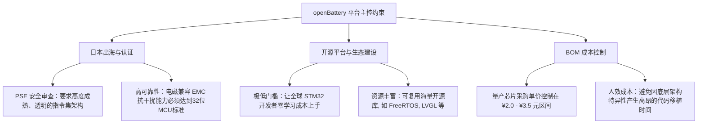

# openBattery 平台未来 MCU 硬件选型与生态战略规划

在 `openBattery` 面向日本市场首发、平台化开源生态建设以及 BOM 成本控制的三重战略诉求下，MCU（主控微控制器）的选型不再是单一的“价格比拼”，而是关乎**供应链安全、出海认证信任度、开发者开源生态门槛**的系统性战役。

本规划根据最新的方案研讨，正式确立 `openBattery` 的未来 MCU 选型路线及软硬件架构层面的对齐设计。

---

## 1. 核心战略诉求与选型约束

在制定主控选型方案时，必须同时满足以下三个层面的硬性约束：



---

## 2. 核心方案深度对比分析

针对“STM32G0 替代降本”，我们重点评估了**“1. 最佳平衡方案：华大半导体 (HC32)”**与**“3. 生态兼容方案 (CKS32 / HK32)”**两大核心技术路径：

| 评估维度 | 路径 A：华大半导体 (HDSC - HC32F030) | 路径 B：生态兼容方案 (航顺 HK32 / 中科芯 CKS32) |
| :--- | :--- | :--- |
| **日本市场适配度** | **中等**<br>自研内核与专有外设库在日本出海及 PSE 认证机构中的认知度较低，在技术文件（TCF）送审时需要提供更多底层的测试与安全背书，增加了前期的沟通与时间成本。 | **高 (推荐)**<br>采用全球主流且成熟的 **ARM Cortex-M0+** 架构，技术文件对齐全球顶尖主流（STM32）规范，极易获得日本安全审查方的技术信任，出海风险极低。 |
| **开源生态潜力** | **较低**<br>华大使用专有的底层外设寄存器和开发工具链。如果以其作为开源平台的底座，相当于强制社区贡献者重新学习一套生态，“造轮子”成本极高，极易劝退开发者。 | **极高 (完胜)**<br>“Pin-to-Pin 兼容”且软件高度兼容。全球数以百万计的 STM32 开发者无需学习任何新工具链，拿到平台即可实现“零门槛”的代码提交与二次开发。 |
| **开发与移植时效** | **较慢**<br>需要开发团队耗费数周时间将现有的 STM32 HAL 层代码物理重写为华大的底层库，拖慢了平台 Bring-up 与兼容多种 SoC 的研发进度。 | **极快**<br>基本可沿用现有的 STM32 软件体系和标准驱动，现有代码与工具链直接复用，研发人员能集中精力死磕 I2C 鲁棒性与功率分配等业务。 |
| **量产 BOM 成本** | **极具竞争力 (¥1.5 - ¥2.5)**<br>在纯芯片采购单价上具有 0.5 - 1.0 元的微弱优势。 | **高度竞争力 (¥2.0 - ¥3.5)**<br>相比 STM32G0 原厂（¥7.0 - ¥10.0）直接降本 60% 以上，大批量采购时该微小差价完全可通过供应链优化平抑。 |
| **综合战略风险** | **中等**<br>平台强绑定单一国产芯片厂的库，若未来发生供应链调整，代码迁移极为痛苦。 | **极低**<br>代码架构完全通用化。若 HK32 缺货，可随时秒级平替为 APM32、CKS32 或兆易创新 GD32。 |

---

## 3. 最终战略抉择：生态兼容起步 + 高度解耦的“双轨化”架构

为了支撑 `openBattery` 平台“**主攻日本市场、兼容多种 SoC、打造繁荣开源生态**”的长远目标，平台规划确立以下两步走及双轨化架构设计：

### 3.1 硬件主线选型：首发标准化生态兼容 MCU
*   **首选型号**：**航顺 HK32F030** 或 **中科芯 CKS32F030**（封装以 `TSSOP20` 或 `LQFP32` 为主）。
*   **定位**：将其作为 `openBattery` 开源硬件原理图的 **默认主控参考设计**。
*   **战略考量**：在平台第一天发布时，就拥有完美的“类 STM32”低开发阻力。用最成熟的技术路线通过日本 PSE 认证，快速占领日本高品质移动电源平台心智。

### 3.2 软件“双轨化”架构设计 (HAL 与业务层彻底解耦)
为了在未来能够弹性接入“极致低成本方案（如华大、应广 8 位机）”或“USB 协议原生方案（如沁恒 CH32 RISC-V）”，本平台必须在代码组织层面实施**绝对的边界防御**：

```text
+-------------------------------------------------------------------+
|               应用层 app/ (人机交互、自锁诊断、IAP 固件升级)         |
+-------------------------------------------------------------------+
|               服务层 services/ (智能功率分配、紧急过流/温控保护)       |
+-------------------------------------------------------------------+
                                  ||
              通过规范的统一 API 接口进行数据与控制交互
                                  ||
+-------------------------------------------------------------------+
|          驱动抽象层 drivers/ (SoC SAL / 外部电芯探针标准 API)       |
+-------------------------------------------------------------------+
|          硬件抽象层 hal/ (i2c, uart, adc, exti 统一总线接口)        |
+-------------------------------------------------------------------+
                                  ||
                         隔离底层具体 MCU 寄存器
                                  ||
+-------------------------------------------------------------------+
|  [主线轨道] STM32F103/G0/HK32F030  |  [低成本轨道] 华大 HC32 / 8位MCU |
+-------------------------------------------------------------------+
```

#### 软件隔离策略规范：
1. **上层（app/, services/）零寄存器依赖**：
   * 严禁在上层逻辑中直接调用任何具体 MCU 的硬件寄存器。
   * 所有数据获取（如电池电压、温度、过流状态）必须通过 `drivers/soc_sal.h` 提供的标准 API（如 `soc_get_voltage`）完成。
2. **底层（hal/）高度可替换性**：
   * 底层对 GPIO、I2C 总线、EXTI 中断的配置，统一收敛在 `hal/` 目录下。
   * 如果未来某家客户要求极致降本，需要导入 **华大 HC32** 或 **8 位 MCU**，**仅需重写 `hal/` 目录下的寄存器映射与驱动实现，上层的功率分配策略、UI 交互及诊断保护代码完全不用修改**。

---

## 4. 落地步骤与当前演进路线

根据此硬件选型设计，本项目的演进路线明确如下：

1. **当前 Bring-up 验证阶段 (Week-0518)**：
   继续围绕手头的 **`野火小智 STM32F103C8T6 核心板`** 推进。此时不急于更换物理芯片，而是**重点打通高鲁棒性带防死锁自愈的 `hal_i2c` 驱动，并构建“紧急告警高速通道”（EXTI 中断接口）**。因为这一套 register-level 驱动在稍后迁移至 HK32F030 或 G071 时，代码的兼容度极高。
2. **量产样板阶段 (V1)**：
   设计量产参考板，将主控 MCU 正式迁移至 **航顺 HK32F030**，搭配英集芯 IP5386 (SoC)，开始跑全链路功能，准备送测日本 PSE 认证。
3. **生态扩张阶段 (V2)**：
   开源硬件图纸与完整 BSP。依靠 `hal/` 层的卓越解耦，联合开源社区推出基于“华大 HC32”的极致降本分支，以及基于“沁恒 CH32V”的 USB 高速通讯数据查询分支，打造繁荣的 `openBattery` 开源生态。
