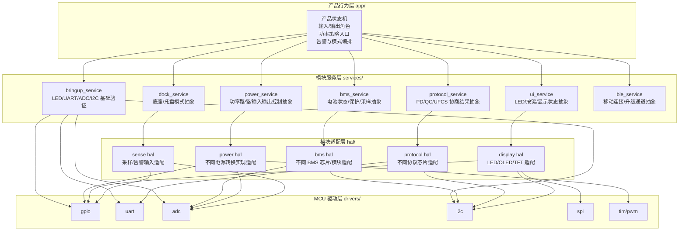
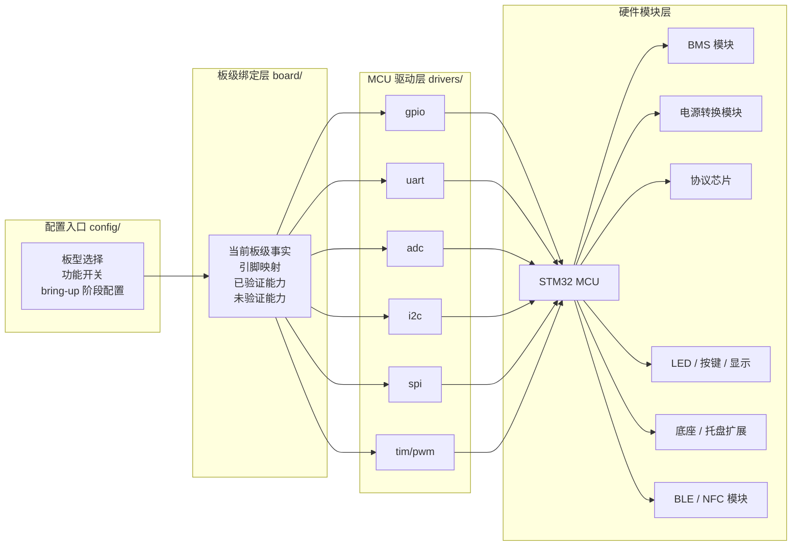

# bmsClaw 模块化硬件与软件框架

> 归档说明：本文是历史版本，保留用于追溯早期架构口径，不代表当前 MCU 主线。当前主线以 `F103 bring-up（当前学习和开发） -> F030 量产候补（生产环境预计使用，需样片验证）` 为准，详见 `0_System/16.mcu_hardware_selection.md`。

> 最新更新：2026-05-10

## 1. 文档目的
本文档用于统一 `bmsClaw` 当前阶段对“平台要做什么、当前已经做到哪里、后面应如何分层推进”的理解。

它重点回答三件事：

1. 当前需求到底在收敛什么。
2. 开源平台方案的核心诉求是什么。
3. 当前 `openBmsClaw` 工程应该按照什么架构继续演进。

本文档是：

- 当前主线架构文档
- 组内讨论用统一口径
- 后续代码分层和模块接入的边界依据

本文档不是：

- 完整产品规格书
- 量产硬件定板文件
- 对 `90.mini-Lite` 的直接照搬

---

## 2. 当前需求理解

## 2.1 当前主目标
`bmsClaw` 当前主目标，不是先做出一台功能堆满的移动电源整机，而是先形成一套：

- 可模块化裁剪
- 可逐步接入真实硬件
- 可由中小团队二次开发
- 可从最小 bring-up 逐步演进到平台化

的开源电源管理 / BMS 平台起点。

换句话说，当前最重要的不是“先把所有功能写全”，而是“先把结构搭对、边界讲清、起步工程跑稳”。

## 2.2 当前阶段的真实落点
结合 `1_Plan` 与 `2_Action` 的最新收敛，当前阶段更准确的落点是：

1. 以 `openBmsClaw` 现有 STM32 起步工程作为当前代码事实。
2. 以 `STM32F103C8T6` 学习板作为当前最小验证平台。
3. 先完成 `LED / UART / ADC / I2C` 等基础 bring-up 与可观测性建设。
4. 先把 `board / drivers / hal / services / app / config` 结构固定下来。
5. 为后续 `BMS / protocol / power / dock / BLE` 接入预留标准接口。

因此，当前需求不是“本周完成完整移动电源平台”，而是：

> 先把平台骨架、板级入口、最小调试链路和后续模块接入边界做正确。

## 2.3 当前需求中的边界澄清
为避免讨论跑偏，需要固定以下边界：

- `openBmsClaw/`：当前代码事实与验证入口。
- `90.mini-Lite/`：参考项目，只提炼能力样本，不作为当前实现。
- `build/`：生成物，不作为架构事实来源。
- `91.reference/`：外部资料归档，不默认作为当前实现内容。

---

## 3. 开源平台的核心诉求

## 3.1 平台不是单一产品固件
`bmsClaw` 要服务的对象，不是单一 SKU，而是一类可变化的移动电源 / BMS 方案。

所以平台必须优先支持：

- 不同 MCU 基线
- 不同 BMS 芯片或 BMS 模块
- 不同协议芯片
- 不同显示与交互形态
- 不同底座 / 托盘扩展方式

## 3.2 平台必须解决的核心问题
开源平台真正要解决的是下面这些重复成本：

1. 更换 BMS 或协议芯片时，不要整套业务逻辑重写。
2. 从学习板验证切到后续平台板时，不要推翻目录结构。
3. 从单一样机走向多个 SKU 时，不要所有逻辑重新复制。
4. 新成员加入时，能快速看清模块职责、接线入口和验证路径。

## 3.3 平台架构应坚持的原则

### 1) 分层
产品行为、模块服务、芯片适配、MCU 外设访问必须分层，避免所有逻辑回流到 `main.c`。

### 2) 模块化
`BMS / power / protocol / ui / dock / ble` 都应以“能力模块”定义，而不是直接绑定某个具体芯片实现。

### 3) 可观测
平台起步阶段必须优先保证日志、LED、错误状态、采样结果可观察，否则后续接模块会持续陷入盲调。

### 4) 可替换
上层调用应依赖统一接口，而不是依赖某个寄存器表、某块特定评估板或某个客户项目结构。

### 5) 小步验证
先做最小可运行验证，再扩展复杂功能，而不是在起步阶段一次性堆完整产品逻辑。

---

## 4. 当前代码事实与推荐路线

## 4.1 当前代码事实
当前仓库内可确认的代码事实是：

- 当前工程路径：`openBmsClaw/`
- 当前工程名：`openBmsClaw`
- 当前器件事实：`STM32F103C8T6`
- 当前入口事实：`Src/main.c` 已经是薄入口
- 当前主流程事实：`main() -> board_init() -> app_init() -> app_run()`
- 当前结构事实：工程已开始引入 `app / services / board / config / drivers`

这说明当前项目已经不再只是“空模板工程”，而是已经进入“可继续沉淀平台骨架”的阶段。

## 4.2 当前已实现
截至目前，可以明确写为“已实现 / 已落位”的内容主要是：

- STM32 起步工程已存在
- `main.c` 已收敛为薄入口
- 已形成基本目录分层方向
- 已为 `BMS / power / protocol / ui / bringup` 预留服务层位置

## 4.3 当前未完成
当前不能写成“已完成”的内容包括：

- 完整 `LED / UART / ADC / I2C` 板级闭环全部稳定
- 真实 `BMS` 芯片接入
- 真实 `USB-C/PD` 协议联调
- 电源转换链路控制闭环
- 底座 / 托盘完整模式
- BLE / OTA

## 4.4 推荐路线
当前推荐路线应明确分成三层理解：

- 当前学习与最小验证路线：`STM32F103C8T6` 学习板 + `openBmsClaw`
- 长期平台参考路线：`STM32G0` 系列
- 未来量产路线：落到具体 MCU 型号，而不是停留在开发板型号

也就是说：

> 当前 F103 是起步验证平台，不等于长期平台芯片路线已经最终定型。

---

## 5. 总体架构理解

## 5.1 架构核心思想
整体架构应围绕一条主线展开：

> 上层只表达产品行为和模块协同，下层分别承接板级差异、芯片差异和 MCU 外设访问。

这样做的目的，是把三类变化拆开：

- 产品功能变化
- 模块选型变化
- 板级引脚和外设变化

## 5.2 软件分层图

## 5.3 板级绑定与硬件映射图

## 5.4 这两张图要表达的重点

1. `app/` 不应直接碰具体引脚和寄存器。
2. `services/` 表达的是平台能力，不是某颗芯片的驱动文件。
3. `hal/` 负责模块适配，不是 MCU 通用外设驱动层。
4. `drivers/` 只负责 MCU 外设访问。
5. `board/` 与 `config/` 统一承接“当前这块板到底有什么、哪些能力已验证”。

---

## 6. 各层职责说明

## 6.1 `app/`
`app/` 是产品行为编排层。

它负责：

- 启动流程编排
- 运行态状态机
- 输入 / 输出角色组织
- 不同服务之间的调用顺序

它不负责：

- 具体 GPIO 电平操作
- 具体 I2C 读写
- 某颗 BMS 芯片寄存器细节

## 6.2 `services/`
`services/` 是平台能力层。

它负责把“产品想做什么”翻译成“模块应该提供什么能力”，例如：

- `bms_service`：读取电池状态、告警、保护信息
- `power_service`：组织输入输出功率路径控制
- `protocol_service`：组织协议协商状态和请求档位
- `ui_service`：组织 LED / 按键 / 显示行为
- `bringup_service`：组织当前最小 bring-up 验证顺序

## 6.3 `hal/`
`hal/` 是模块适配层，不是 ST 官方 HAL 的替代名词。

它负责：

- 把不同供应商模块适配为统一接口
- 把上层从具体芯片寄存器表中隔离出来

例如：

- 今天接 `BMS A`，明天换成 `BMS B`
- 今天接 `PD 芯片 A`，后面换成 `PD 芯片 B`

只要 `hal/` 层接口稳定，上层服务就不需要大改。

## 6.4 `drivers/`
`drivers/` 是 MCU 外设访问层。

它负责：

- GPIO
- UART
- ADC
- I2C
- SPI
- TIM/PWM

这一层只关心“怎么访问 MCU 外设”，不关心“产品为什么要这么做”。

对当前 `bmsClaw` 而言，这一层的职责不会因为是否使用 RTOS 而改变。
无论运行环境是裸机主循环还是 RTOS 任务调度，`drivers/` 都仍然只负责总线通信与外设访问，不承载业务状态机。

## 6.5 当前对 RTOS 的判断
MCU 平台在工程实践里，通常有两种主流运行方式：

- 裸机开发：主循环 + 中断
- RTOS：例如 `FreeRTOS`、`Zephyr`

但对 `bmsClaw` 当前阶段而言，不应把 RTOS 作为默认前提。

当前这样判断的原因是：

1. 当前工程事实仍是 `main() -> board_init() -> app_init() -> for(;;) app_run()` 的最小主循环。
2. 当前首要目标是 `LED / UART / ADC / I2C` bring-up、可观测性和模块边界固定。
3. 当前复杂度还没有高到必须引入任务调度器才能维持可维护性。
4. 最小起步阶段优先降低系统复杂度，比提前引入 RTOS 更重要。

因此，当前推荐口径是：

> `bmsClaw` 当前默认采用裸机主循环 + 中断方式推进，不把 RTOS 作为起步阶段前置依赖。

后续在下面这些情况明显出现时，再评估是否引入 RTOS：

- 协议、BMS、功率路径、显示、BLE 等模块并发复杂度明显上升
- 周期任务、优先级和异步事件开始难以用简单状态机维护
- 裸机主循环已经明显影响模块解耦和可维护性
- MCU 资源与团队维护能力足以承受 RTOS 成本

## 6.6 `board/`
`board/` 是板级事实层。

它应该统一描述：

- 当前板型
- 引脚映射
- 当前已验证能力
- 当前未验证能力
- 不同板型差异

对于当前项目，这一层尤其关键，因为当前主线强调：

> 先忠实记录当前学习板事实，再往平台化抽象推进。

## 6.7 `config/`
`config/` 是功能开关与平台配置层。

它应该承接：

- 板型切换
- 功能开关
- bring-up 阶段差异
- SKU 裁剪项

这样后续切换板型或功能组合时，优先改配置，而不是到业务代码中散改。

---

## 7. 硬件模块边界

## 7.1 BMS 模块
`BMS` 负责：

- 电芯电压、电流、温度采样
- 保护状态
- 告警状态
- 均衡相关状态

它不等于电源转换模块。

## 7.2 电源转换模块
`power conversion` 负责：

- 输入电源路径
- 输出供电路径
- 升降压控制
- 端口功率协同
- 限流、降额与故障退回

它不等于 BMS，也不等于协议协商。

## 7.3 协议模块
`protocol` 负责：

- PD / QC / UFCS 等协商
- 端口角色切换
- 请求档位管理
- 协商结果上报

它的结果会影响电源转换策略，但它本身不是电源路径实现。

## 7.4 UI / Dock / BLE 模块
这些模块都应视为平台可替换能力：

- `UI`：LED、按键、显示
- `dock`：底座、托盘、扩展工作模式
- `BLE`：手机连接、参数查看、OTA 等扩展通道

它们可以逐步接入，但不应在当前阶段反向拖垮基础 bring-up。

---

## 8. 当前阶段建议的工作顺序

## 8.1 第一阶段：稳定当前起步工程
先把下面几件事做稳：

1. `board_init()`、`app_init()`、`app_run()` 主流程固定。
2. `LED / UART / ADC / I2C` 基础 bring-up 跑通。
3. 日志、错误状态、基础采样结果可观察。

## 8.2 第二阶段：固定模块接入口
在起步工程稳定后，继续做：

1. 固定 `services/*` 接口
2. 固定 `hal/*` 模块适配入口
3. 固定 `board/*` 与 `config/*` 的板级表达方式

## 8.3 第三阶段：按模块接真实硬件
推荐顺序：

1. 输入链路相关准备
2. 协议模块接入
3. BMS 模块接入
4. 电源转换控制接入
5. 底座 / 托盘扩展
6. BLE / OTA

这个顺序的核心原因是：

- 先让系统能看见、能调试、能记录
- 再让系统接入真实模块
- 最后再叠复杂产品行为

---

## 9. 对组内讨论的统一口径

后续讨论时，建议统一按下面四类表述：

- **当前代码事实**：仓库里已经存在、已经落位的结构或代码。
- **已实现**：已经完成并能被当前工程支撑的内容。
- **规划中**：方向已经明确，但还未完成代码或板测验证。
- **参考项目**：来自 `90.mini-Lite` 的能力样本，不等于当前主线实现。

尤其需要避免三种常见混淆：

1. 把参考项目写成当前实现。
2. 把规划中的平台能力写成已完成。
3. 把当前 F103 起步板写成最终量产芯片路线。

---

## 10. 当前结论
当前 `bmsClaw` 最合理的架构理解是：

- 先承认当前事实：主代码入口是 `openBmsClaw` 的 `STM32F103C8T6` 起步工程。
- 先收敛当前目标：完成最小可运行验证与模块边界固定。
- 先搭好平台骨架：`app / services / hal / drivers / board / config`。
- 再逐步接入真实 `BMS / protocol / power / dock / BLE` 模块。

因此，当前这份架构文档的核心结论不是“平台已经做完”，而是：

> 我们已经明确了平台要服务什么、当前从哪里起步、以及后续应该按什么边界继续推进。
