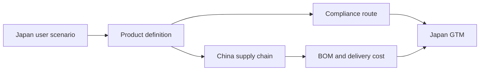

# Diagrams

这里保存可复用图表。

优先使用 Markdown 表格、Mermaid 或 ASCII 图，便于版本管理和后续复用。

## 推荐图表

| 图表 | 用途 |
|---|---|
| 日本低压储能场景地图 | 解释用户、空间、负载和购买理由 |
| 产品分型图 | 区分便携式储能、DC 移动电源、户储、小工商储、大储 |
| 储能系统结构图 | 解释电芯、BMS、PCS、EMS、负载、电网关系 |
| 日本认证路线图 | 解释 PSE、S-JET、JIS、JET 系统连系、JC-STAR |
| 中国供应链地图 | 解释电芯、BMS、PCS、PACK、认证资料责任 |
| 渠道利益分配图 | 解释电商、众筹、线下、安装商、B2B 客户 |

## Mermaid 示例

