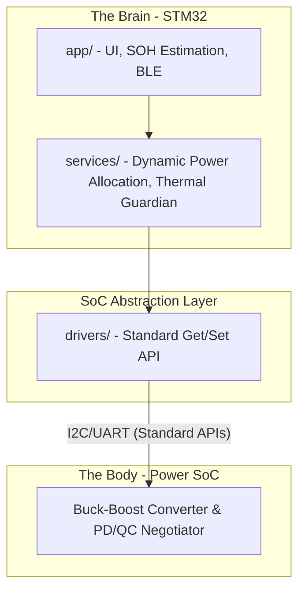

# openBattery (openBmsClaw)

[](https://opensource.org/licenses/MIT)
[](https://www.st.com/)
[](https://en.wikipedia.org/wiki/C99)

An open-source Battery Management System (BMS) and power management platform designed for small-to-medium mobile power manufacturers. Targeting high-quality consumer electronics standards (such as Japan's PSE compliance), `openBattery` provides a flexible, modular, and transparent alternative to proprietary "black-box" power banks.

---

## 🚀 The Vision: "Brain & Body" Dual-Chip Architecture

Traditional mobile power designs wrap fast-charging protocols and battery safety into a closed-source, unconfigurable black box. `openBattery` revolutionizes this by separating high-power physical regulation from intelligent monitoring:

*   **The Body (Dedicated SoC):** Handles high-frequency buck-boost conversion, fast-charge protocol handshakes (PD/QC/UFCS), and hardware-level safety interrupts.
*   **The Brain (MCU - STM32):** Oversees intelligent power allocation, predicts remaining runtime, monitors battery State of Health (SOH), drives user interface displays (OLED/LED), and handles wireless communication (BLE).



---

## 🛠️ Key Features

*   **Multi-Port Dynamic Power Allocation:** Automatically renegotiates output power when multiple devices are plugged in.
*   **Thermal Protection & Intelligent Derating:** Continuously monitors battery temperature via NTC and adjusts charger current/output power limits dynamically.
*   **Visualized Battery Health (SOH):** Real-time prediction of remaining charge/discharge time, capacity degradation, and health status.
*   **Vendor-Agnostic SoC Driver Layer:** A unified hardware abstraction layer supporting major power SoCs (IP53xx, SW35xx, etc.) using a "definition over source code" standard.
*   **Safety & Compliance Preparedness:** Pre-designed architectures conforming to PSE certification guidelines and portable aviation limits (≤100Wh).

---

## 📁 Repository Structure

```text
openBattery/
├── 0_System/          # Architecture specifications & system design docs
├── 1_Plan/            # Active development milestones and roadmap
├── openBmsClaw/       # STM32 C implementation & workspace project
│   ├── Src/           # Application logic and drivers
│   ├── Inc/           # Header files
│   └── CMakeLists.txt # Main build configuration
├── 90_documents/      # External docs, kickoff plans, reference tutorials
└── 91.reference/      # Archived external materials & SoC selection guides
```

---

## 🔧 Getting Started & Development

### Prerequisites
*   **Target Core Board:** Wildfire Xiaozhi STM32F103C8T6 (Dual USB variant) or STM32G0 reference boards.
*   **Debugger:** ST-LINK / J-Link (SWD interface).
*   **Compiler Toolchain:** `arm-none-eabi-gcc` and CMake.

### Build Instructions
To build the firmware using CMake:
```bash
cd openBmsClaw
mkdir build && cd build
cmake ..
make
```

---

## 🤝 Contributing

We welcome contributions from power electronics engineers, embedded software developers, and product designers. 
*   Before making significant changes, please review our [System Architecture Specification](0_System/00.tech_architecure.md).
*   Follow the **Brain-Body Separation** principle: application code must never directly manipulate registers on the SoC without going through the abstraction drivers.

## 📄 License

This project is licensed under the MIT License - see the LICENSE file for details.
